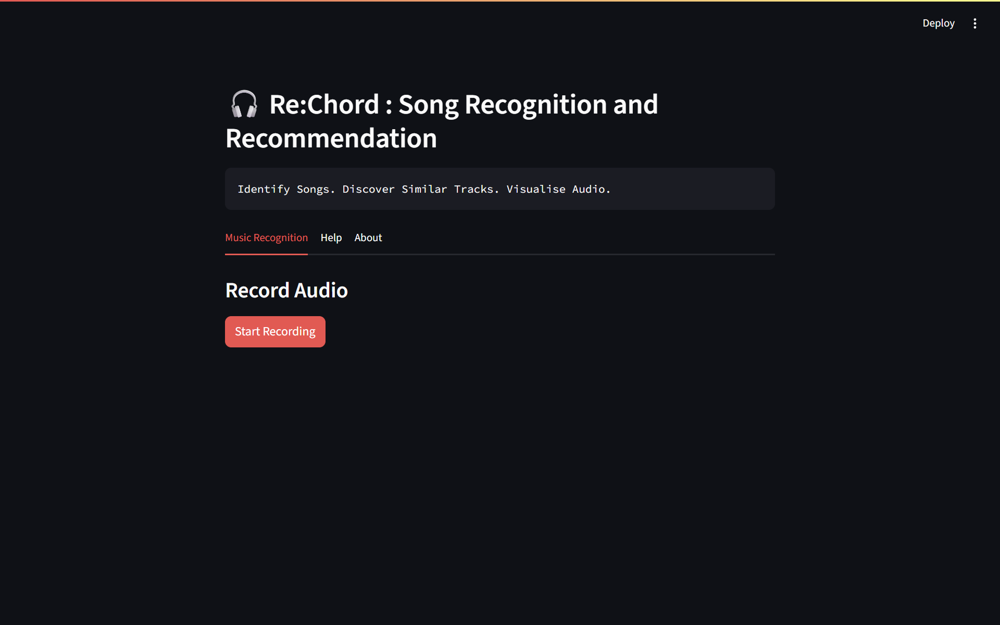
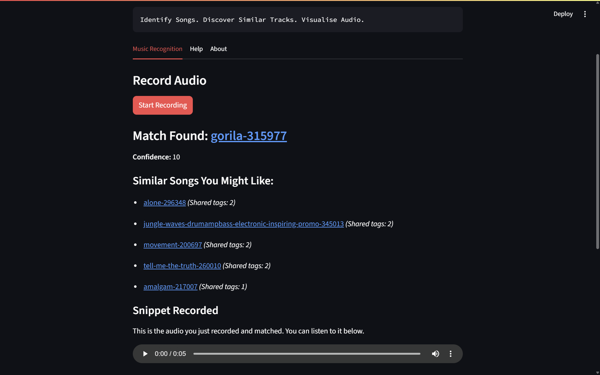
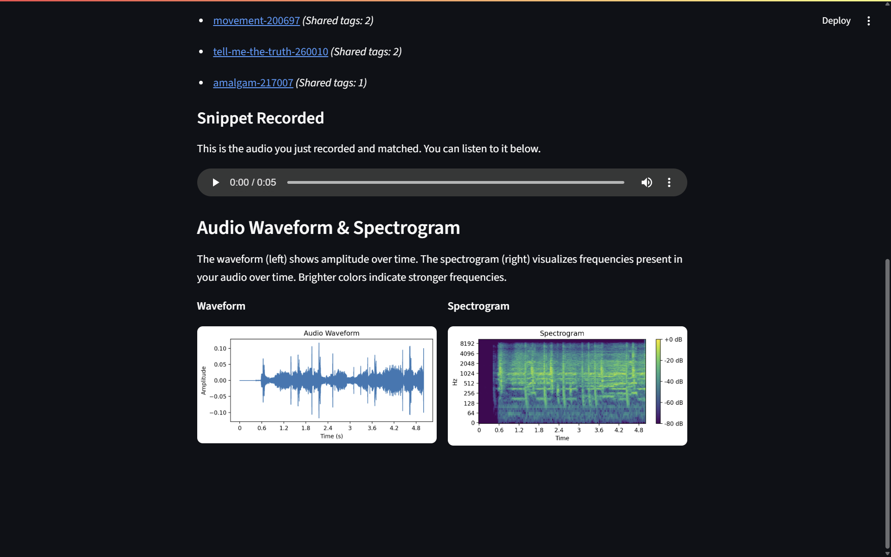

# 🎧 Re:Chord: Song Recognition & Recommendation

**Identify songs • Discover similar tracks • Visualize audio**


## Overview
Re:Chord is an application that recognizes short audio clips, suggests five similar songs, and displays easy-to-read visualizations (waveform & spectrogram). It’s a hands-on demo of audio fingerprinting and content-based recommendations.


## Objectives
- Build real-time song recognition from 5 s snippets or uploaded files.
- Recommend top 5 tracks by shared tags.
- Show waveform and spectrogram to explain audio analysis.
- Store metadata in a simple SQLite database.


## Key Features
1. **Live Recognition** – Record via microphone (local only)
2. **Fast Matching** – Hash frequency peaks and search for the best fingerprint match  
3. **Smart Suggestions** – Recommend similar tracks using tag-based filtering  
4. **Clear Visuals** – Plot waveform & spectrogram with Matplotlib  


## How It Works
1. **Input** – 5 s recording or file upload  
2. **Fingerprinting** – Extract peaks, create a hash table  
3. **Lookup** – Query SQLite for the closest match  
4. **Output** – Display song title, confidence, and audio visuals  
5. **Recommendations** – List five tracks sharing key musical tags  


## Tech Stack
- **Python 3.8+**
- **Streamlit** (UI)  
- **Librosa** (audio analysis)
- **SoundDevice** (recording)  
- **Matplotlib** (plots)
- **SQLite** (storage)  


## Quick Start
```bash
git clone https://github.com/Manthan-D-Parmar/Re-Chord-Song-Recognizer.git
cd Re-Chord-Song-Recognizer
pip install -r requirements.txt
streamlit run app.py
````

## Demo Screenshots

Here are some screenshots showcasing Re:Chord in action:




  

  


*Developed by Manthan Parmar • MIT License • Tracks from Pixabay Music*

